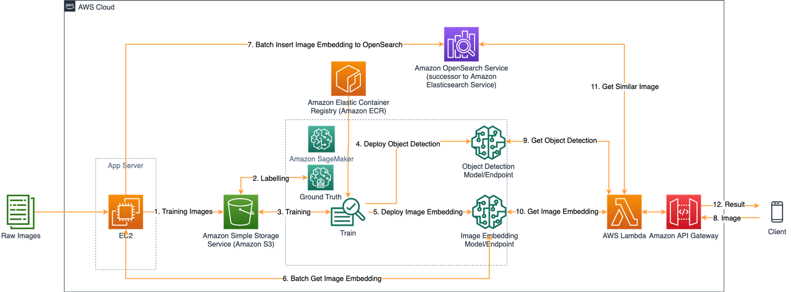
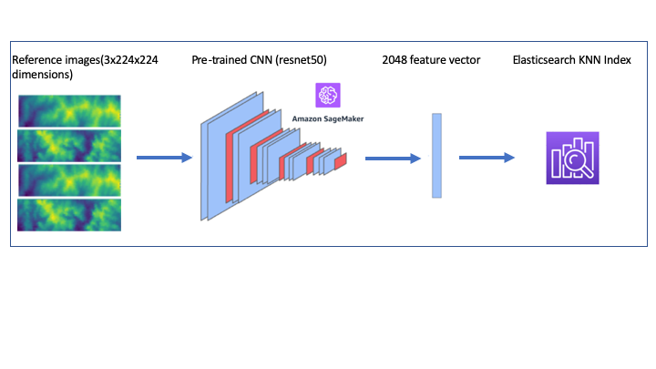
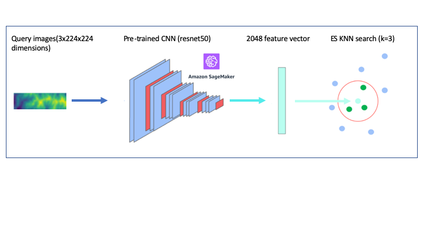
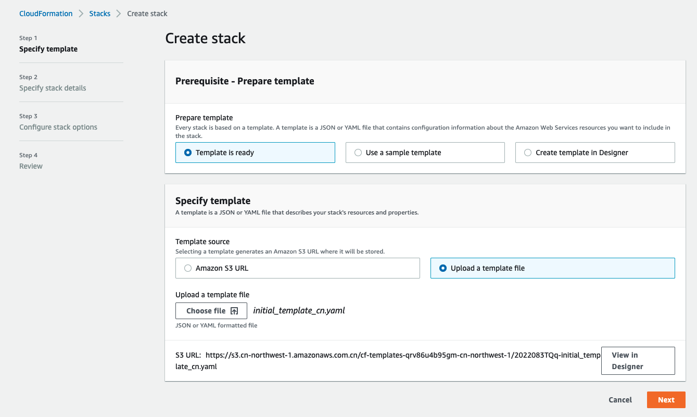
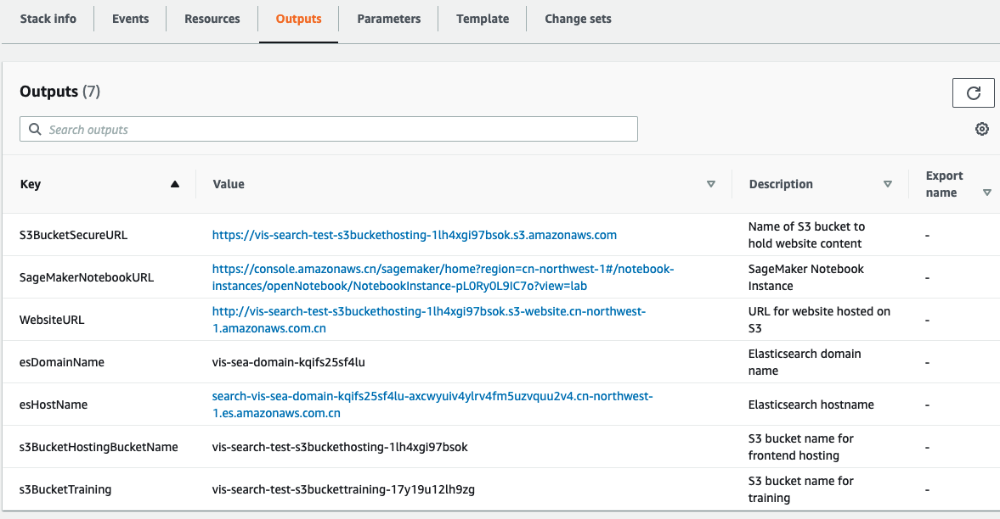
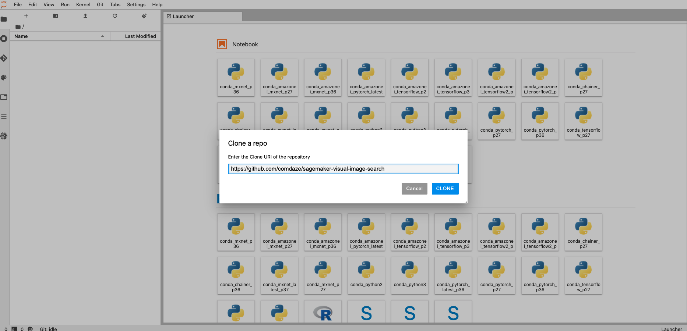
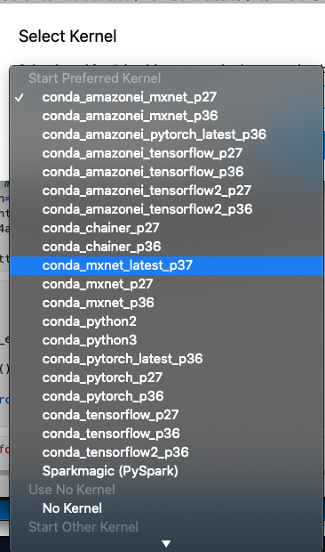

## 可视化图像搜索Workshop
这个Workshop是实现了端到端的一个可视化图像搜索应用程序。它主要使用使用Amazon SageMaker和Amazon Elasticsearch等组件。架构如下：



这个workshop面向AWS中国区域部署，在Global部署请参考：

[aws-samples/amazon-sagemaker-visual-search](https://github.com/aws-samples/amazon-sagemaker-visual-search)

## 如何工作?

我们将使用feidegger (zalandoresearch数据集)的Fashion Images作为参考图像或者自定义数据集比如地形图，使用卷积神经网络生成2048个特征向量，并存储到Amazon Elasticsearch KNN索引中



当我们提出一个新的查询图像时，它正在计算来自Amazon SageMaker托管模型的相关特征向量，并查询Amazon Elasticsearch KNN索引来找到类似的图像



## 实验步骤
1、复制项目代码，如果在中国无法直接git clone，可以浏览器进入下载项目zip包。
```
git clone https://github.com/comdaze/sagemaker-visual-image-search.git
```
2、采用cfn/initial_template_cn.yaml模版文件在Cloudformation服务中创建stack，自动初始化资源,可以在AWS图形化管理控制台操作：



或者可以采用aws cli
```
cd sagemaker-visual-image-search/cfn
aws cloudformation create-stack --stack-name vis-search --template-body file://initial_template_cn.yaml --capabilities CAPABILITY_IAM --profile zhy
```
执行完毕后可以在输出看到SagemakerNotebookURL的地址



3、点击进入Notebook实例的的jupterlab，clone代码：



进入sagemaker-visual-image-search目录，打开[visual-image-search-gluoncv-cn.ipynb](./visual-image-search-gluoncv-cn.ipynb)，修改内核为conda_mxnet_latest_p37：



4、然后开始在[visual-image-search-gluoncv-cn.ipynb](./visual-image-search-gluoncv-cn.ipynb)继续执行。


## License

This library is licensed under the MIT-0 License. See the LICENSE file.
