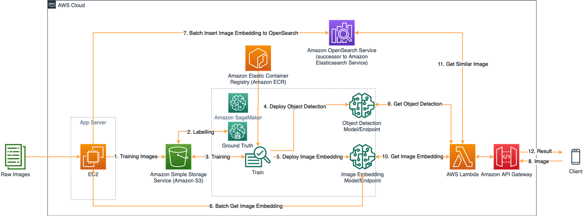
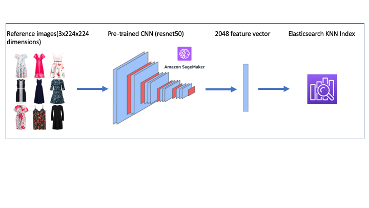
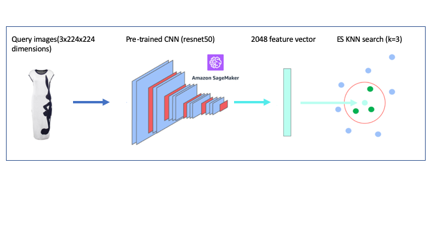

## 可视化图像搜索Workshop
这个Workshop是实现了端到端的一个可视化图像搜索应用程序。它主要使用使用Amazon SageMaker和Amazon Elasticsearch等组件。架构如下：

这个workshop面向AWS中国区域部署，在Global部署请参考：

[aws-samples/amazon-sagemaker-visual-search](https://github.com/aws-samples/amazon-sagemaker-visual-search)

## 如何工作?

我们将使用feidegger (zalandoresearch数据集)的Fashion Images作为参考图像或者自定义数据集比如地形图，使用卷积神经网络生成2048个特征向量，并存储到Amazon Elasticsearch KNN索引中

当我们提出一个新的查询图像时，它正在计算来自Amazon SageMaker托管模型的相关特征向量，并查询Amazon Elasticsearch KNN索引来找到类似的图像

## Use GluonCV

在AWS中国区域运行[visual-image-search-gluoncv-cn.ipynb](./visual-image-search-gluoncv-cn.ipynb), 训练脚本为[transfer_learning.ipynb](./transfer_learning.ipynb)

## License

This library is licensed under the MIT-0 License. See the LICENSE file.
